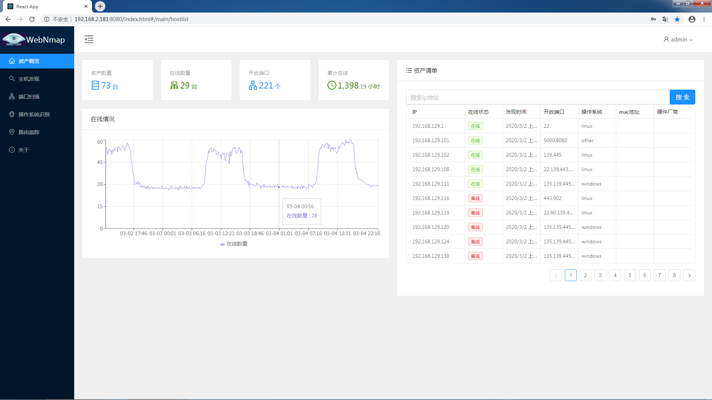

# Wnmap

使用web控制nmap进行扫描

### 基本功能

- 支持下发、更新、删除定时扫描任务
- 支持主机发现、端口扫描、操作系统识别等任务的定时执行
- 汇总所有结果并展示，设备在线情况统计
- 在线时长top10，最近上线，最近离线的设备信息
- 开放端口最多的主机top10，出现最多次的端口top10
- 操作系统类型占比统计
- 路由追踪traceroute功能，各节点延迟情况，地图展示
- 服务端运行信息，包括本系统运行时长，任务数量，发现设备数量，相关开源项目
- 服务器实时处理器和内存的负载情况，历史情况

### 启动方法

- 安装 [nmap](https://nmap.org/) 并设置环境变量
- 下载jar包 [地址](https://github.com/Alfriend-xing/wnmap/releases/download/0.0.1/wnmap-0.0.1-SNAPSHOT.jar)

- `java -jar wnmap-0.0.1-SNAPSHOT.jar` (linux和windows均可)

- 之后可以访问 `http://localhost:8080/index.html` 登陆操作，账号密码会显示在页面上，管理员和访客有不同权限。

>注：上述命令可正常启动项目，但是路由追踪功能无法正常使用。
>需要下载IP地址库至相同路径下重启系统。
> - [cities500.txt](http://download.geonames.org/export/dump/cities500.zip)(geonames项目，提供地名对应的经纬度)
> - [GeoLite2-City.mmdb](https://dev.maxmind.com/geoip/geoip2/geolite2/)(maxmind公司提供的IP位置库，国内IP不准)
> - [ip2region.db](https://github.com/lionsoul2014/ip2region/blob/master/data/ip2region.db)(github用户lionsoul2014的ip2region项目，提供国内IP和位置信息，国外IP不准)
>> 上述文件都是 ip-地理位置 的免费解决方案，均可以免费下载，因为文件比较大所以没有随本项目一起提供，有需要的朋友自行下载吧。

### 其他资源

本项目的用到的开源项目有：

- 前端部分：react, antd, leaflet, recharts
- 后端部分：spring boot, security, data; nmap4j, icmp4j
- 扫描工具：nmap
- 
- 

### 截图

[更多截图](img/img.md)

